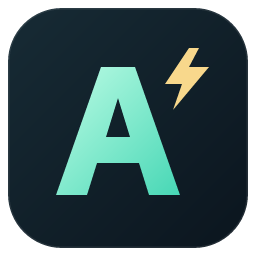

<p align="center">
  
</p>

# AgentLite

AgentLite 是一个本地运行的 AI Agent 项目。它通过大模型理解任务，循环调用工具读取代码、修改文件、执行命令，并将结果返回给你。支持 VS Code 聊天插件、终端界面（TUI）和命令行（CLI），三个入口共用一个 Python 后台服务 `lite-core`。

可以用它理解代码库、定位问题、实现功能或执行开发任务。模型通过 Anthropic 或 OpenAI-compatible API 调用；会话与工具记录保存在本机。

## 主要功能

- **多轮对话**：流式回复、历史会话恢复、会话改名和模型切换。
- **工具执行**：读取与写入文件、执行 shell 命令、网页搜索与抓取、执行计划。
- **文件保护**：读取去重、精确编辑、覆盖前版本校验、原子写入，以及文件历史 CLI 恢复；支持 PDF 分页文字与图片读取。见[文件操作说明](docs/file-operations.md)。
- **权限确认**：支持允许一次、始终允许、拒绝一次、始终拒绝。
- **子 Agent**：支持任务分工、后台执行与完成通知。
- **MCP 扩展**：接入 STDIO、Streamable HTTP 和 TCP 工具服务器。
- **上下文管理**：查看模型用量、压缩上下文；大工具结果独立保存，模型接收有限预览并可按需读取。
- **VS Code 聊天**：工具过程、任务取消、回答收藏，以及图片上传、粘贴和拖入（需要视觉模型）。

## 环境要求

| 用途 | 要求 |
| --- | --- |
| Python 后端与终端入口 | Python 3.12，建议使用 uv 管理环境 |
| VS Code 插件 | 本地桌面 VS Code 1.106 或更新版本 |
| 从源码构建插件 | Node.js 22.12 或更新版本、npm |
| 调用模型 | 服务商的 API key，以及可访问的模型端点 |

当前插件面向受信任的本地文件夹；尚不支持 Remote、WSL 和虚拟工作区。

## 快速开始

### 1. 安装 Python 后端

在 AgentLite 仓库根目录执行：

```powershell
uv sync
```

这会创建 `.venv` 并安装项目和开发依赖。下面的 `uv run` 命令均在仓库根目录执行，无需手动激活虚拟环境。

使用已有 Python 3.12 环境时，也可以执行 `python -m pip install -e .`；安装后直接使用 `lite`、`lite-core` 和 `lite-tui`。

### 2. 配置模型与密钥

模型配置放在用户目录，所有项目共用。`~` 表示用户主目录；Windows 对应 `C:\Users\<用户名>`。如果目录不存在，先创建 `.agentlite` 文件夹。

在 `~/.agentlite/settings.json` 写入：

```json
{
  "defaultModel": "my-model",
  "models": [
    {
      "id": "my-model",
      "name": "我的模型",
      "protocol": "openai",
      "model": "替换为服务商的模型名称",
      "baseUrl": "https://your-provider.example/v1",
      "apiKeyEnv": "MY_MODEL_API_KEY"
    }
  ]
}
```

将 `model` 和 `baseUrl` 替换为服务商提供的实际值。在同一目录的 `.env` 文件中填写密钥：

```dotenv
MY_MODEL_API_KEY=替换为自己的密钥
```

`protocol` 支持 `openai` 和 `anthropic`。使用 Anthropic 官方接口时，设置为 `anthropic`，填写对应模型名称并省略 `baseUrl`。模型窗口可以通过可选字段 `contextWindow` 指定，单位为 token。

OpenAI 模型可通过 `apiMode` 选择接口：`"chat_completions"`（默认）或 `"responses"`。省略该字段时，已有配置继续使用 Chat Completions。该字段仅用于 `protocol: "openai"`。例如 RightCode 的 Responses 配置：

```json
{
  "id": "rightcode-responses",
  "name": "RightCode Responses",
  "protocol": "openai",
  "apiMode": "responses",
  "model": "替换为账户可用模型",
  "baseUrl": "https://www.rightapi.ai/codex/v1",
  "apiKeyEnv": "MY_MODEL_API_KEY"
}
```

将此对象加入 `models` 数组即可在模型列表中选择。也可为同一模型创建两个不同 `id` 的配置，分别选择两种接口。`baseUrl` 填到 `/v1`，不要包含 `/responses` 或 `/chat/completions`。Responses 使用本地会话历史（`store: false`），支持流式文本、函数工具调用和图片输入。修改配置后下一次请求生效；更新代码后需重启 core。

OpenAI 模型可设置可选字段 `"reasoningEffort": "high"`，作为模型的默认推理强度。VS Code 中 `/reasoning` 打开档位选择，`/reasoning high` 直接设置，`/reasoning default` 恢复模型配置或服务商默认值。TUI 支持 `/reasoning` 查看当前值和可选档位，以及相同的参数命令。会话覆盖仅影响当前会话，从下一轮请求生效，并在恢复会话时保留；新会话使用模型默认值。主代理和子代理沿用该选择，切换不兼容模型时清除会话覆盖。

Responses 使用 `reasoning.effort`，Chat Completions 使用 `reasoning_effort`。可用值取决于模型及中转站：已知 OpenAI 模型会限制选择范围；自定义模型名称由上游校验，不自动降档。Anthropic 暂不支持此设置。参见 [OpenAI 推理模型文档](https://developers.openai.com/api/docs/guides/reasoning)。

也可以先打开 VS Code 插件，在输入框输入 `/settings` 创建并编辑 `settings.json`。后端可在没有密钥时启动，发送消息时才检查凭证。

JSON 保存模型信息，密钥放在 `.env` 或进程环境变量中。系统环境变量优先于用户 `.env`；项目目录的 `.env` 不会被读取。修改模型 JSON 后下一次请求生效，修改已加载的密钥需要重启 core。

### 3. 选择使用入口

#### VS Code 插件

先安装插件构建依赖：

```powershell
cd extensions/vscode
npm install
```

回到 VS Code 的 AgentLite 仓库窗口，在“运行和调试”中选择 **AgentLite: VS Code Demo**，按 **F5** 打开扩展开发窗口。执行命令 **AgentLite: 打开聊天**，或点击右侧辅助侧边栏的 AgentLite 标签。

要安装到日常使用的 VS Code，在 `extensions/vscode` 中执行：

```powershell
npm run package
```

然后在扩展面板菜单选择 **从 VSIX 安装**，选中生成的 `.vsix` 文件。当前插件通过本地 VSIX 安装。

在其他项目使用插件时，在 VS Code 用户设置中指定已安装 AgentLite 的解释器。例如 Windows：

```json
{
  "agentLite.pythonPath": "C:\\path\\to\\AgentLite\\.venv\\Scripts\\python.exe"
}
```

macOS/Linux 对应 `.venv/bin/python`。聊天会话使用当前打开的项目作为工作区，Python 后端和模型配置可以共用，无需每个项目都安装一份。

打开聊天后直接输入任务，例如“解释这个项目的启动流程”。**Enter** 发送，**Shift+Enter** 换行；工具执行过程中可确认权限或取消任务。顶部可新建、恢复会话或查看收藏，输入框底部可选择模型。

要引用当前工作区的文件或目录，在消息中输入 `@` 搜索名称，或点击输入框下方的 **+ → 引用工作区文件**。选中后会显示高亮引用标签，可点击 × 移除；发送时 AgentLite 会读取文件或查看目录。搜索遵守 `.gitignore`，默认只显示顶层。仅手动输入路径而未从列表选中时，它只是普通消息文字。

在输入框开头输入 `/` 可查看快捷命令，已支持 `/new`、`/history`、`/model`、`/settings`、`/status`、`/logs` 和 `/mcp`。通过 `/mcp` 可查看、添加和管理工具服务器。

插件安装图标为 [icon.png](extensions/vscode/media/icon.png)，矢量源为 [logo.svg](extensions/vscode/media/logo.svg)，侧边栏使用 [agentlite.svg](extensions/vscode/media/agentlite.svg)。构建时自动生成 PNG 图标。更多设置和开发说明见 [VS Code 插件文档](extensions/vscode/README.md)。

#### 终端界面（TUI）

在仓库根目录执行：

```powershell
uv run lite-tui
```

TUI 会自动连接或启动后台 core，提供多轮聊天、工具结果、权限确认和会话恢复。可在输入框输入 `/` 查看可用命令。

#### 命令行（CLI）

先启动后台服务，再开始交互聊天：

```powershell
uv run lite core start
uv run lite chat
```

或执行单次任务：

```powershell
uv run lite run --goal "检查当前项目的目录结构并解释主要模块"
```

CLI 将运行命令时的当前目录作为任务工作区。已安装到 Python 环境后，可以在目标项目中直接运行 `lite chat` 或 `lite run --goal "..."`。

## 后台服务与重启

VS Code 和 TUI 默认自动启动并共享 core。最后一个前端退出后，core 等待 15 秒再自动停止；仅隐藏聊天面板不算退出。

| 命令（仓库根目录执行） | 用途 |
| --- | --- |
| `uv run lite core status` | 查看后台状态 |
| `uv run lite core start` | 启动常驻服务，或将已有自动服务转为常驻 |
| `uv run lite core stop` | 停止共享后台服务 |
| `uv run lite ping` | 检查连接 |
| `uv run lite-core` | 在当前终端前台运行服务，方便调试 |
| `uv run lite trace` | 查看运行跟踪记录 |

修改 Python 后端代码或已加载的密钥后，等待任务结束，执行 `uv run lite core stop`，再重连 VS Code 或重新打开 TUI。原会话可以继续使用。更新插件后执行 VS Code 的 **开发人员: 重新加载窗口**。

## 配置与本地数据

| 路径 | 内容 |
| --- | --- |
| `~/.agentlite/settings.json` | 模型列表与默认模型 |
| `~/.agentlite/.env` | API key 与环境配置 |
| `~/.agentlite/config.toml` | core、工具、权限、上下文等配置 |
| `~/.agentlite/mcp.json` | MCP 服务器配置 |
| `~/.agentlite/sessions/` | 会话消息、事件和独立工具结果文件 |
| `~/.agentlite/logs/` | 默认日志目录 |

core 的 TOML 配置按“内建默认值 → 用户配置 → 启动目录的 `.agentlite/config.toml` → 环境变量”覆盖。设置 `AGENTLITE_CONFIG` 后只读取指定的 TOML 文件。模型 JSON 始终从用户目录读取。

大工具结果的保存、预览预算与按需读取方式见 [工具结果存储说明](docs/tool-result-storage.md)。

## 技能（Skills）

在工作区的 `.agentlite/skills/<名称>/SKILL.md` 或用户目录的 `~/.agentlite/skills/<名称>/SKILL.md` 创建技能；也支持这些目录下的旧格式 `<名称>.md`。仅加载 AgentLite 内置技能和这两个专属目录，不扫描 `.codex/skills/`、`.claude/skills/` 或 `.agents/skills/`。同名技能以工作区版本优先。文件使用 YAML frontmatter 描述 `name`、`description`，正文写技能指令；可选 `allowed-tools` 列表限制工具。

在 VS Code 聊天输入框输入 `/skills` 可浏览并选择技能，随后补充参数发送；也可直接发送 `/<名称> 参数`。正文中的 `$ARGUMENTS` 会替换为参数。TUI 同样支持斜杠调用。

内置 `/skill-creator` 可创建或修改 AgentLite 技能，例如 `/skill-creator 创建一个解释 Python 代码的技能，包含执行流程和输入输出示例`。默认写入工作区 `.agentlite/skills/<名称>/SKILL.md`；明确要求跨项目使用时写入用户技能目录。

```markdown
---
name: review
description: 检查代码问题
---
请检查 $ARGUMENTS，报告具体文件和行号。
```

## 常见问题

**插件提示找不到 Python 或 AgentLite**：先在仓库执行 `uv sync`，然后将 `agentLite.pythonPath` 设置为仓库 `.venv` 中的 Python 3.12 解释器。

**修改后仍表现为旧版本**：后台进程不会自动重新加载代码；任务结束后停止 core 并重连。插件更新还需要重新加载 VS Code 窗口。

**无法连接模型**：确认 `model`、协议和 API 地址与服务商一致，`apiKeyEnv` 指向实际存在的密钥变量。密钥配置在用户 `.env`，不是当前项目 `.env`。

**AgentLite 标签出现在左侧**：右键视图标题，将它移动到“辅助侧边栏”。VS Code 会保留之前的位置设置。

## 项目结构与开发

```text
src/agent_lite/
  core/             后台服务、Agent 循环、模型接口、工具与会话
  cli/              命令行入口
  tui/              终端聊天界面
extensions/vscode/  VS Code 插件与聊天页面
tests/              Python 单元测试与集成测试
docs/               设计与实现说明
```

Python 检查在仓库根目录执行：

```powershell
uv run pytest tests/unit -q
uv run pytest tests/integration -m "not integration" -q
uv run ruff check src tests scripts
uv run mypy src
```

插件检查在 `extensions/vscode` 执行 `npm run check` 和 `npm test`。真实模型测试单独运行，会产生 API 请求；具体步骤见 [插件文档](extensions/vscode/README.md)。


# 计划模式

VS Code 默认不显示模式标签。在 `/` 菜单选择 Plan 或输入 `/plan` 进入计划模式后，
模型右侧显示“灯泡 + Plan”。悬停或键盘聚焦时灯泡变为叉号，点击标签退出计划模式。
重复选择 `/plan` 保持开启；运行期间不能切换模式。
计划模式先阅读代码，再通过弹窗逐题询问影响方案的偏好；每次只问一个问题，
收到答案后模型重新思考，按需提出下一题。每题提供 2–3 个选项，可以直接点击选择、
填写其他方案或 Skip 跳过。默认选项不会自动提交，
等待回答不会因普通工具的超时限制而结束，取消任务会清理待回答请求。

最终方案以独立 Plan 卡片展示，支持展开、复制、打开和下载 Markdown。
点击“开始执行计划”会切换为执行模式并提交该计划；
也可留在计划模式继续修改方案。协作模式随会话保存，恢复历史会话后仍然生效。
TUI 使用 `/plan`、`/plan on`、`/plan off`，同样支持选择题弹窗；执行时先 `/plan off` 再发送执行指令。

当前计划模式只提供文件读取、目录浏览和网页查询工具，文件写入、Shell、MCP 和子代理
不开放，以保证规划期间不会执行修改。最终计划的质量和是否需要提问由所选模型决定。


## 会话权限模式

新会话默认使用 **Auto**；旧会话缺少权限字段时保持 **Manual**。
TUI 用 `/mode manual|edits|auto|plan` 或 Shift+Tab 切换。VS Code 点击输入区的盾牌图标，展开 Manual、Edit automatically、Auto 三项权限菜单；Plan 通过 `/plan` 进入。
CLI 支持 `lite chat --permission-mode manual` 和 `lite run --goal "任务" --permission-mode auto`。

- **Manual**：沿用现有审批策略及长期授权记录。
- **Edit automatically**：自动允许工作区普通文件编辑和能确认的只读命令；保护路径、危险操作和工作区外文件编辑需确认。
- **Auto**：普通编辑和查询直接执行，其余操作由独立模型根据真实用户意图审批；模型不可用、超时或无法确定时询问用户。
- **Plan**：只读探索和生成计划，保留此前权限模式；进入、退出 Plan 需运行空闲。

Auto 不使用整工具级长期放行，也不提供“始终允许”；已有授权记录在 Manual 中继续有效。
保护目录、敏感配置和已识别的高危操作始终要求确认。分类器的每次判断会产生一次额外模型请求，放行结果不缓存。
用户意图独立保存在会话目录的 `permission_users.jsonl`，不会从压缩摘要、工具输出或子 agent 的任务提示推断授权。
旧会话没有该日志时，未收到新的真实用户输入前，灰色操作会转人工确认。

用户配置 `~/.agentlite/config.toml` 使用现有的单数配置节：

```toml
[permission]
timeout_s = 60.0
default_mode = "auto" # manual | accept_edits | auto，仅影响新会话
classifier_enabled = true
classifier_model = "" # 留空使用当前运行模型；非空填写 settings.json 中的模型 id
classifier_timeout_s = 20.0
```

对应环境变量为 `AGENTLITE_PERMISSION_DEFAULT_MODE`、`AGENTLITE_PERMISSION_CLASSIFIER_ENABLED`、
`AGENTLITE_PERMISSION_CLASSIFIER_MODEL` 和 `AGENTLITE_PERMISSION_CLASSIFIER_TIMEOUT_S`。
关闭分类器后仍保留普通编辑和查询的快速通道，其余 Auto 操作转人工确认。
运行中可以切换三种权限模式，切换对下一次权限检查生效；已经开始的分类和审批保持原模式。
